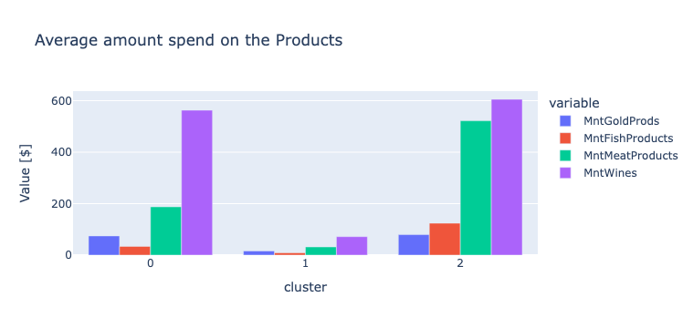
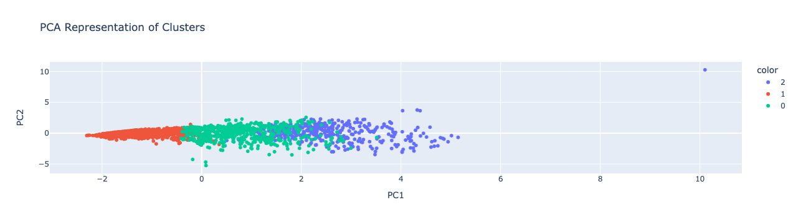

## Customer Segmentation &#128722; &#128102; &#128103;

This repository is dedicated to perform customer segmentation using K-Mean Clustering method using the data published on Kaggle. 

You may find the data in this website:
https://www.kaggle.com/datasets/imakash3011/customer-personality-analysis

## What the K-Mean Clustering?

* The results from K-Mean Clustering might be extremely useful for marketing team to target the right customer group while doing a promotion. Below are the customer segmentation which result in three major cluster 

* Upon the clustering, we can distinctlly identified 3 cluster with different purchasing pattern and income level. &#128181;

* We primarily look into average amount spent on the products especially the wines, gold, meat and fish for past 2 years after based on our feature selection process. &#128031;&#127863;&#127830;

* From the prespective of income level, the cluster 2 is with highest mean income level, followed by cluster 0, and cluster 1. In relation to that, cluster 1 has the lowest spending on these products for the past two years. In comparison between cluster 0 and 2, a clear distinct purchasing pattern can be observed, in which the customer in cluster 2 have consumed more fish and meat products as their source of protein. Hence, promotion on these categories of product can primarily target the customer in cluster 2 as they have more purchasing power in these products.	&#128722;

* Aside from that, it might make sense as well to not include other features such as number of teens, kids, acceptance of promotion and places of purchase as all these factor will be eventually factorized in the amount of spending in those products. Based on these products, we then can roll out promotion to the targeted customers based on categories of product. &#128187; 
